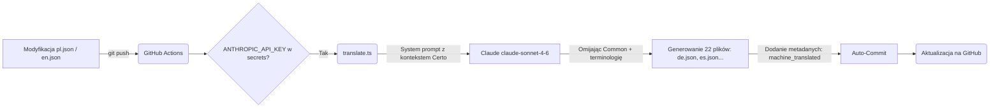

# Architektura Wielojęzyczności w Certo Ecosystem

## Strategia i Zarys Podstawowy

Architektura i18n opiera się o sprawdzoną bibliotekę `next-intl` działającą na Server Components, wspierającą pełne renderowanie 24 języków urzędowych UE. Ekosystem bazuje na dwóch rodzajach zasobów tłumaczeń:

1. **Współdzielony pakiet bazowy** (`packages/i18n`): Główne definicje tłumaczeń dla całej domeny Certo. Odpowiada za ujednoliconą nomenklaturę, metadane czy stopki.
2. **Lokalne nadpisania** (`apps/<serwis>/messages`): Tłumaczenia wyspecjalizowane w danej jednostce operacyjnej — nadpisują one zbieżne klucze lub definują nowe i specjalistyczne słownictwo per dana aplikacja (np. /dashboard, /delegate).

### Wspierane Języki

System obsługuje następujące języki (24): `bg`, `cs`, `da`, `de`, `el`, `en`, `es`, `et`, `fi`, `fr`, `ga`, `hr`, `hu`, `it`, `lt`, `lv`, `mt`, `nl`, `pl`, `pt`, `ro`, `sk`, `sl`, `sv`.

W zależności od aplikacji:
- **Certo Foundation** (`certogov.org`): Default: `pl`, Fallback: `en`
- **Certo ID** (`certo.id`): Default: `en`, Fallback: `en`
- **Certo Consulting** (`certo.consulting`): Default: `pl`, Fallback: `en`

*Uwaga:* Język **irlandzki (`ga`)** jest niszowy, stąd z założenia generowany maszynowo, oznaczony flagą jako `review_required: true`. Treści w tym języku wymagają atencji i weryfikacji przed publikacją oficjalnych materiałów merytorycznych.

## Translation Pipeline

Ekosystem korzysta z mechanizmu asynchronicznych tłumaczeń w oparciu o Anthropic Claude API (model `claude-sonnet-4-6`). Zaletą tego podejścia (w porównaniu do tradycyjnego tłumaczenia maszynowego) jest pełna świadomość kontekstu instytucjonalnego Certo — model otrzymuje szczegółowy system prompt definiujący terminologię zastrzeżoną, ton instytucjonalny i zasady tłumaczenia specyficzne dla sektora governance.

### Flow działania
Proces uruchamiany jest automatycznie przez regułę GitHub Actions.

1. Deweloper, analityk lub tłumacz dokonuje modyfikacji i commita w pliku bazowym `packages/i18n/messages/pl.json` (lub `en.json`).
2. GitHub Action nasłuchuje zdarzenia `push` na gałęzi `main`.
3. Jeśli zmieniono język źródłowy, Action pobiera kod i uruchamia skrypt `packages/i18n/scripts/translate.ts` przy użyciu zaszyfrowanego secretu `ANTHROPIC_API_KEY`.
4. Skrypt wysyła cały JSON do Claude z rozbudowanym promptem systemowym, który:
   - Zachowuje terminologię zastrzeżoną Certo (np. Certo Score, Certo Vector, Compliance Engine) w oryginale
   - Pomija namespace `"Common"` (terminologia współdzielona)
   - Pomija klucze z flagą `"do_not_translate": true`
   - Zachowuje zmienne interpolacji (`{variable}`, `{{variable}}`) i tagi HTML/Markdown
   - Stosuje ton instytucjonalny i terminologię prawną EU
5. Na końcu tworzony jest specjalny metadane `_meta` potwierdzający datę i flagę wygenerowania maszynowo. W tym: `"status": "machine_translated", "source": "claude", "reviewed": false`.
6. Automatyczny commit (`github-actions[bot]`) dorzuca resztę języków na gałąź `main`. Skrypt `translate.yml` zabezpieczony jest przed pętlą akcji dzięki regule `if: github.actor != 'github-actions[bot]'`.

**Diagram:**


### Parametry statusów `_meta`
Wygenerowane pliki posiadają sekcję `_meta` nałożoną na samą górę:
| Klucz             | Opis                                                      | Przykład |
|-------------------|-----------------------------------------------------------|----------|
| `status`          | Znacznik określający jak powstał tekst                    | `machine_translated` |
| `source`          | API lub źródło z którego zaciągnięto słowa                | `claude`  |
| `reviewed`        | Flaga (boolean) weryfikacji przez Human / Native Speakera | `false`  |
| `generated_at`    | ISO Timestamp daty utworzenia pliku JSON                  | `2026-03-18T12:00:00.000Z` |
| `source_language` | Język stanowiący źródło translacji                        | `pl`     |

### Dodawanie ANTHROPIC_API_KEY
W celu poprawnego działania Pipeline'u w GitHub, wejdź w ustawienia repozytorium na Githubie (Repository Settings > Secrets and variables > Actions > **New repository secret**) i dodaj:
* **Name:** `ANTHROPIC_API_KEY`
* **Secret:** Twój klucz API z platformy Anthropic (console.anthropic.com).
Zapisz zmianę. Od tego momentu każde wypchnięcie zmian z `pl.json` wyzwoli poprawną procedurę.

### Omijanie tłumaczeń ("do_not_translate")
Aby wymusić na translatorze pominięcie specyficznego fragmentu, użyj zagnieżdżonego obiektu w słowniku `messages/pl.json`:
```json
"MojaZmienna": {
  "value": "Certo ID Foundation",
  "do_not_translate": true
}
```
Zamiast standardowego klucz: wartość `"MojaZmienna": "Certo ID Foundation"`. Skrypt automatycznie wykryje tę adnotację i zostawi zadeklarowane `"value"` bez poddawania go DeepLowi w każdym z docelowych tłumaczeń.
